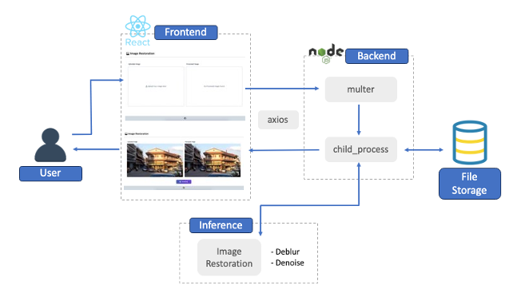
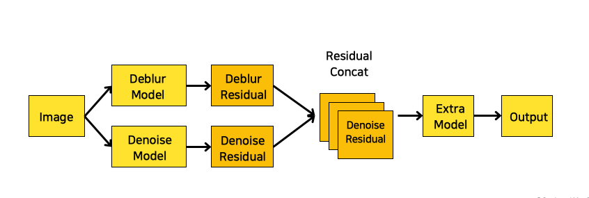

  
 

[📑 Presentation slide]('./docs/Presentation_RestoreNet.pdf')
<br>
<br>

## Introduction

### Background

- The two tasks, Deblur and Denoise, are processed based on opposite principles.
  - In the Deblur task, the process of removing blur enhances the edges of the image, making noise more visible.
  - In the Denoise task, the process of removing noise softens the edges of the image, making them appear smoother or less defined, resembling a blur.
- There is an active research for denoising or deblurring seperately, but there are few attempts to address the issue of image deblurring and denoising of same image, which is common in real life.

### Main feature

- Implement a simple web application for image denoising/deblurring at the same time.

<br>

## Service Architecture



### How does this work?

We made it as simple as possible, so you will only need to remember three steps.

1. React frontend sends an image file to Express backend using POST.\
   For this, we use `http-proxy-middleware` to proxy between frontend and backend server.
2. Backend receives the image frontend sent, and makes the model inference using `child_process`.
3. After the inference, backend sends the name of the restored image, and frontend shows it to the client.

<br>

## Dataset

- Used [DANet](https://github.com/zsyOAOA/DANet) to generate images with both noise and blur, as well as images with noise only, based on the blur datasets(BSD, GoPro, Realblur-J)
- Created four types of images-<i>noise, blur, blur with noise(BLNO), and groundtruth</i>-through augmentation techniques for the same scenes
- Trained with a diverse set of training datasets with various combinations

1. BSD dataset only
2. BLNO type only
3. Combining the four types of images in various ratios [BLNO:Blur:Noise:GroundTruth]
   - 13:2:2:1
   - 11:4:4:1
   - 2:1:1:1

### Base dataset for training

- BSD [here](https://www2.eecs.berkeley.edu/Research/Projects/CS/vision/bsds/)
- RealBlur-J [here](https://cg.postech.ac.kr/research/realblur/)
- GoPro [here](https://seungjunnah.github.io/Datasets/gopro.html)

### Base dataset for validation / test

- RealBlur-Tele [here](https://cg.postech.ac.kr/research/realblur/)

<br>

## Model Architecture



<br>

## Demo

### 0. Requirements

- A server with **CUDA** enabled
- **Node.js**

### 1. Dependencies and Installation

```
# This will install node_modules for backend
cd server/backend
npm install


# This will install node_modules for frontend
cd server/frontend
npm install


# This will install required modules for python
cd RestoreNet
pip install -r requirements.txt


# This will set basicsr modules for inference
python setup.py develop --no_cuda_ext
```

### 2. Download the pretrained weights

- You can download the pretrained weight [here](https://drive.google.com/drive/folders/1vioBTsrzYxiXOEdy4NwGCzUH--Hrn6Eg)
- You will need this pretained models for inference.
- Put these pretained models in `RestoreNet/experiments/pretrained_models`.<br>
  Make directory if you cannot find folders.

### 3. Run the server

```
cd server/frontend
npm run start
```

- This will start both backend and frontend at the same time with the aid of the module
  **concurrently**.

<br>

# Reference

### Paper

- L. Chen, X. Chu, X. Zhang, and J. Sun, “Simple baselines for image restoration,” 2022 ECCV : <i>17th European Conference</i>, pp. 17–33, 2022. doi:10.1007/978-3-031-20071-7_2
- S. W. Zamir et al., “Multi-Stage Progressive Image Restoration,” <i>2021 IEEE/CVF Conference on Computer Vision and Pattern Recognition (CVPR)</i>, 2021. doi:10.1109/cvpr46437.2021.01458
- L. Chen, X. Lu, J. Zhang, X. Chu, and C. Chen, “HINet: Half instance normalization network for image restoration,” <i>2021 IEEE/CVF Conference on Computer Vision and Pattern Recognition Workshops (CVPRW)</i>, 2021. doi:10.1109/cvprw53098.2021.00027
- J. Liang et al., “Swinir: Image restoration using swin transformer,” <i>2021 IEEE/CVF International Conference on Computer Vision Workshops (ICCVW)</i>, 2021. doi:10.1109/iccvw54120.2021.00210
- S. W. Zamir et al., “Restormer: Efficient Transformer for high-resolution image restoration,” <i>2022 IEEE/CVF Conference on Computer Vision and Pattern Recognition (CVPR)</i>, 2022. doi:10.1109/cvpr52688.2022.00564
- J. Rim, H. Lee, J. Won, and S. Cho, “Real-world blur dataset for learning and benchmarking Deblurring algorithms,” <i>Computer Vision – ECCV 2020</i>, pp. 184–201, 2020. doi:10.1007/978-3-030-58595-2_12
- Y. Zhao et al., “D2HNet: Joint denoising and Deblurring with hierarchical network for robust night image restoration,” <i>2022 ECCV : 17th European Conference</i>, pp. 91–110, 2022. doi:10.1007/978-3-031-20071-7_6
- D. Sun, Y. Shi, and Y. Feng, “Blind deblurring and denoising via a learning deep CNN denoiser prior and an adaptive L0‐regularised gradient prior for passive millimetre‐wave images,” <i>IET Image Processing</i>, vol. 14, no. 17, pp. 4774–4784, 2020. doi:10.1049/iet-ipr.2020.1193
- Y. Pang, J. Lin, T. Qin, and Z. Chen, “Image-to-image translation: Methods and applications,” <i>IEEE Transactions on Multimedia</i>, vol. 24, pp. 3859–3881, 2022. doi:10.1109/tmm.2021.3109419
- J. Su, B. Xu, and H. Yin, “A survey of deep learning approaches to image restoration,” <i>Neurocomputing</i>, vol. 487, pp. 46–65, 2022. doi:10.1016/j.neucom.2022.02.046
- J. Mustaniemi, J. Kannala, J. Matas, S.Särkkä, and J. Heikkilä, “LSD2 — Joint Denoising and Deblurring of Short and Long Exposure Images with CNNs, <i>The 31st British Machine Vision Virtual Conference(BMVC)</i>, 2020.
- Y. Park, M. Jeon, J. Lee, and M. Kang, “MCW-net: Single Image deraining with multi-level connections and wide regional non-local blocks,” Signal Processing: <i>Image Communication</i>, vol. 105, p. 116701, 2022. doi:10.1016/j.image.2022.116701
- S. Xie, R. Girshick, P. Dollar, Z. Tu, and K. He, “Aggregated residual transformations for deep neural networks,” <i>2017 IEEE Conference on Computer Vision and Pattern Recognition (CVPR)</i>, 2017. doi:10.1109/cvpr.2017.634
- S.loffe, and C.Szegedy, “Batch Normalization: Accelerating Deep Network Training by Reducing Internal Covariate Shift”, <i>ICML'15: Proceedings of the 32nd International Conference on International Conference on Machine Learning</i>, vol.37, pp.448-456, 2015. doi:10.48550

### Code

- Noise Generation [code](https://github.com/zsyOAOA/DANet)
- Image Deblur / Denoize [code](https://github.com/megvii-research/NAFNet)
